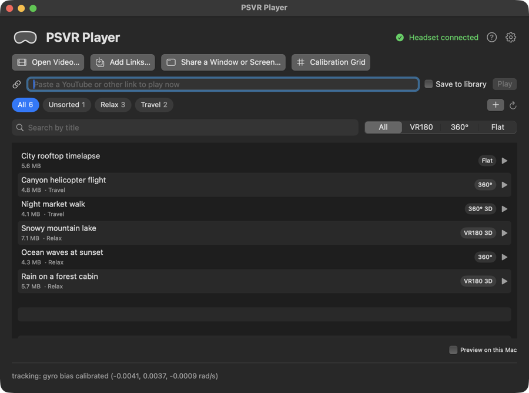
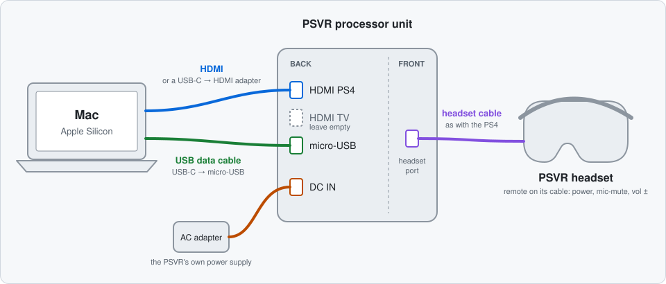
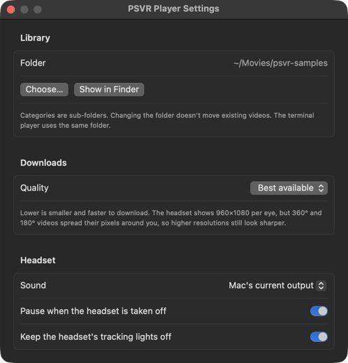
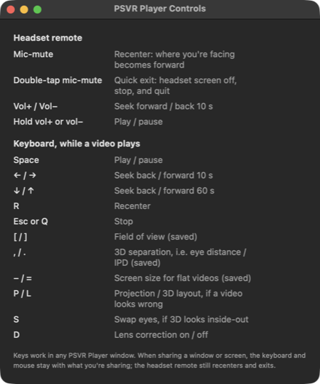

# psvr-mac

Use a PlayStation VR (v1, CUH-ZVR1/ZVR2) as a VR video headset on an Apple Silicon Mac.
No PS4, no Rosetta, and nothing to install beyond Xcode's command-line tools.

- **PSVR Player.app**: the Mac app. Library of your VR videos, open files, paste YouTube links, share any
  window or screen onto a virtual screen, calibration grid.
- `psvrplayer`: the same player from the terminal, with every option (see below)
- `psvrctl`: turns the headset on/off, switches VR/cinematic mode, and shows head-tracking data

Convenience and privacy options: a quick exit on the headset remote, pausing when you take the headset off,
headset lights off, and a choice of sound device.

Plays 360°, 180° and flat videos (mono, side-by-side or top-bottom 3D) with head tracking and PSVR lens and
colour correction, YouTube VR180/360° links, and a head-tracked virtual screen for any Mac window.



## Why

I had a PlayStation VR lying around after I stopped using my PS4, and wanted a small, fun project to put it to
use. It turned out to make a pretty good VR video headset for a Mac, so here it is, in case yours is gathering
dust too.

## Requirements

- An Apple Silicon Mac (M1 or later) with macOS 14 or later, and Xcode's command-line tools to build.
- A PlayStation VR v1 (CUH-ZVR1 or CUH-ZVR2) with its processor unit, HDMI cable and a micro-USB data cable.
- For video links only: `brew install yt-dlp ffmpeg node` (Node.js helps with YouTube's checks).

Tested on a 16" MacBook Pro (M2 Pro) with macOS 27 and a CUH-ZVR2. Reports from other Macs and headsets are welcome.

## Wiring

<picture>
  <source media="(prefers-color-scheme: dark)" srcset="docs/images/wiring-dark.svg">
  
</picture>

The USB cable must carry data (not a charge-only cable). It's how the Mac sends commands and reads head tracking.

## Build

```sh
git clone https://github.com/i33mr/psvr-mac.git && cd psvr-mac
scripts/build-app.sh                  # builds "PSVR Player.app" and installs it in /Applications
swift build -c release                # the command-line tools
cp .build/release/psvrctl .build/release/psvrplayer bin/
```

## The app

Open **PSVR Player** from Applications or Spotlight. It connects to the headset by itself (top right shows
"Headset connected").

- **Library**: videos in `~/Movies/psvr-samples` (another folder can be chosen in Settings), labelled (VR180 3D, 360°, Flat 3D…). Double-click or ▶ to play.
  Right-click: Move to (a category), Show in Finder, Move to Trash.
- **Categories** are sub-folders of the library (e.g. *Relax*, *Travel*), shown as tabs; **+** makes one. Right-click
  a category tab for **Loop videos** (everything in it repeats until you stop it, nice for ambience), Show in
  Finder, or Remove Category (its videos move back to *Unsorted*). Because they are plain folders, Finder and the
  terminal tool see the same organisation.
- **Search** by title, and filter by type (VR180 / 360° / Flat).
- **Add Links…**: paste several links, one per line, and choose a category. They download one after another in the
  background (a Downloads panel shows progress, reasons for failures, cancel and retry); you can keep browsing or
  watching meanwhile.
- **Open Video…** (⌘O), drag videos onto the window or the Dock icon, or right-click a video in Finder →
  *Open With → PSVR Player*.
- **Link field**: paste a YouTube (or other) link and press Play; it downloads with a progress bar, then plays.
  Tick *Save to library* to keep it (into the category you're viewing).
- **Share a Window or Screen…**: macOS's sharing picker, then the window appears on the virtual screen.
- **Calibration Grid**: checks tracking and lenses.
- **Settings…** (⌘, or the gear): library folder, download quality (best, or up to 4K / 1440p / 1080p to save
  space and time), sound device, pause when the headset is off, and headset lights (see
  [Convenience and privacy](#convenience-and-privacy)).
- **Controls** (the **?** button, or Help → PSVR Player Controls): every key and headset-remote button. Keys work
  while a video plays, in any of the app's windows.
- **Preview on this Mac** (bottom right): for the next video only, see below.

<p>
  
  
</p>

The app is signed locally (ad hoc), not by a developer account. Rebuilding it with `scripts/build-app.sh`
replaces it in place.

## Convenience and privacy

- **Quick exit**: double-tap the **mic-mute** button on the headset's inline remote (within 0.5 s) to get out of VR
  right away. The headset screen switches off at once, playback stops, and the player quits (the terminal player
  also clears its terminal). The next start turns the headset back on.
- **Pause when headset is off** (Settings, on by default; terminal `--pause-when-off`): taking the headset off
  pauses the video and blacks out its screen; putting it back on resumes from 2 seconds earlier. Start a video
  before putting the headset on and it waits for you. Space resumes anyway.
- **Headset lights off** (Settings, on by default): keeps the headset's blue tracking lights off while the app
  is open (they're only for the PlayStation Camera); they come back on when you quit. During playback a button
  changes it live. Terminal: `--lights-off`, or anytime `bin/psvrctl lights off|on|0-100`.
- **Sound** (Settings): "Mac's current output", or a specific device such as your headphones, which is remembered.
  Sound plays only there: if that device isn't connected, videos play without sound (the main window says so). Terminal:
  `--sound <name>` (matches part of the name).
- **Preview on this Mac** (small checkbox, bottom right of the main window): shows the headset view (undistorted, left eye) in a small
  window on the Mac. Off by default, confirmed when ticked, and it applies to the next video only. Terminal:
  `--mirror`.

## Use from the terminal

1. Connect everything as above and turn the headset on (power button on the inline remote).
2. **System Settings → Displays**: the PSVR appears as a second display named **SIE HMD**.
   Set it to **Extended**, not mirrored. When mirrored, macOS doesn't treat it as a separate display.
3. Start the calibration grid, with the headset resting still on a table:
   ```sh
   bin/psvrplayer --test
   ```
   On the first run after plugging in, the player patches the display to 120 Hz RGB (the image blanks briefly),
   then switches the headset into VR mode. Wait for `tracking: gyro bias calibrated`, put the headset on, and press **R**
   to recenter. You should see a grid with a green horizon and a red line straight ahead.
4. Play a video:
   ```sh
   bin/psvrplayer ~/Movies/some_video_360_TB.mp4
   ```

Add `--loop` to repeat short clips until you quit.

Keys work in the player window **and** in the terminal you started it from.

| Key | Action |
|---|---|
| Space | play / pause |
| ← / → | seek 10 s |
| ↓ / ↑ | seek 60 s |
| R, or the headset's mic-mute button | recenter (make where you face "forward") |
| **Double-tap mic-mute** (within 0.5 s) | **quick exit**, see [Convenience and privacy](#convenience-and-privacy) |
| Headset vol+ / vol− tap | seek forward / back 10 s |
| Hold headset vol+ or vol− (~0.6 s) | play / pause |
| P / L | cycle projection (360 → 180 → flat) / layout (mono → sbs → tb) |
| S | swap eyes (if 3D looks inside-out) |
| D | lens correction on/off |
| [ / ] | field of view −/+ 1° (saved) |
| , / . | 3D separation −/+ 0.1° (saved): match the 3D to your eye spacing |
| − / = | flat screen size |
| Esc / Q / Ctrl-C | quit (puts the headset back in cinematic mode) |

The remote reports only one button at a time (two pressed together read as one), so gestures are sequences
and holds. The volume buttons also change the volume of earphones plugged into the remote, in hardware; with
sound on the Mac's speakers or AirPods that has no effect.

### Your settings

Field of view and 3D separation are saved to `~/.config/psvr-mac/settings.json` whenever you change them and
used for every video. The library folder chosen in the app's Settings is stored there too (`libraryPath`), so the
terminal player uses the same library. To tune 3D, play a 3D video with a person or object at a few metres and press `,` or `.`
until it looks life-sized and your eyes feel relaxed. Delete the file to go back to defaults.

### YouTube and other video links

```sh
bin/psvrplayer "https://www.youtube.com/watch?v=…"          # download, play, delete afterwards
bin/psvrplayer --keep "https://www.youtube.com/watch?v=…"   # save it to the library instead
bin/psvrplayer --download-only --to Relax <link> <link> …  # add several to a category, no playback
```

The link is downloaded with `yt-dlp` first (progress is shown), then played like a file. It works with YouTube and
most sites `yt-dlp` supports. Details:

- **Quality:** the best stream this Mac decodes in hardware, usually **4K at 60 fps (VP9)** on YouTube. YouTube's 8K
  is AV1 only, which the M2 can't decode in hardware (M3 and later can). `--max-height 2160` limits it if needed.
- **Size:** 4K60 VR180 is about 3 GB per 10 minutes, so it takes a moment to start.
- **YouTube VR180** is stored in YouTube's own fisheye-like layout described by a mesh in the file; the player reads
  that mesh and renders it exactly. YouTube 360° videos are standard equirectangular.
- **Cleanup:** the download lives in `~/Library/Caches/psvr-mac/downloads` and is deleted when you quit, on a
  quick exit, and at the start of the next download. With `--keep`, the video and a small `.mesh` file next to
  it (the projection, which MP4 repackaging would otherwise drop) go to your library folder.
- YouTube sometimes cuts a download off (HTTP 403) or throttles it to a crawl, because yt-dlp has no "PO token"
  proving it is a real player. The player handles both: it resumes interrupted downloads with a fresh link (up to
  5 tries), and fetches a fresh link when the speed drops below 2 MB/s. Re-running the same link also resumes.
- If downloads start failing, YouTube changed something: `brew upgrade yt-dlp` usually fixes it. Node.js, if
  installed, is used for YouTube's checks.

### Virtual screen (any Mac window, website or game)

```sh
bin/psvrplayer --share                     # pick a window, app or screen with macOS's sharing picker
bin/psvrplayer --share-window Safari       # share a window by app name or title (needs Screen Recording
                                           # permission for your terminal)
```

The window appears on a large screen fixed in space, head-tracked at 120 Hz, captured at up to 60 fps with
mipmapped scaling so text stays clean. Keep using the shared app as usual: keyboard and mouse stay with it
(the player never takes focus), and the mouse pointer shows on the virtual screen. `-` / `=` change the screen
size (saved), and **L** switches to side-by-side 3D for apps that output it (for example the Dolphin emulator's
side-by-side stereoscopic mode). Player keys work in the terminal you started it from, plus the headset remote.

The headset shows about 10 pixels per degree, so small text is hard to read; zoom the shared app in (⌘+) or make
the screen bigger.

### Video formats

The format is guessed from the file name and aspect ratio, and the player prints what it picked.
Use `--projection 360|180|flat` and `--layout mono|sbs|tb` to override it.

| File looks like | Guessed as |
|---|---|
| 2:1, or `_360` | 360° mono |
| 1:1, or `_360_TB` / `_OU` | 360° 3D top-bottom |
| `_180_LR` / `_180_SBS` (2:1) | 180° 3D side-by-side |
| 16:9 | flat mono (virtual cinema screen) |
| 32:9, or `_SBS` | flat 3D side-by-side |

The player uses macOS's own decoders, so MP4/MOV/M4V files with H.264, HEVC or VP9 work. Convert anything else (MKV, VP9):
`ffmpeg -i in.mkv -c:v libx264 -crf 18 -c:a aac out.mp4`.
Fisheye VR180 isn't supported, only equirectangular.

### Sound

Audio plays on the Mac's current output, or on the device chosen in the app's Settings (`--sound` in the terminal;
see [Convenience and privacy](#convenience-and-privacy)). To hear it through earphones plugged into the headset's
inline remote, choose the PSVR's HDMI audio device (**SIE HMD**) there or in **System Settings → Sound → Output**.

### Preview without the headset

`bin/psvrplayer --window --no-headset video.mp4` plays in a window on the Mac's screen. Drag with the mouse to look around.

## Why 120 Hz, and the EDID patch

In VR mode the processor unit passes the signal straight to the panels and shows **nothing unless it gets
1920×1080 RGB at 120 Hz (or 90 Hz)**, which is what a PS4 sends. Its EDID, though, tells the Mac it can only take
60 Hz (23–61 Hz, max 150 MHz HDMI clock) and that it accepts YCbCr. So by default a Mac drives it at 60 Hz and VR mode stays black.

`psvrplayer` (or `psvrctl display unlock`) fixes this by injecting a patched EDID through a private macOS API
(`IOAVServiceSetVirtualEDIDMode`; Apple Silicon ignores EDID override files). The patch adds 1080p 90/120 Hz timings,
raises the HDMI clock limit to 300 MHz, and declares RGB only. Nothing is written to disk: the patch lasts until
`psvrctl display reset`, a reboot, or unplugging the HDMI cable. The player re-applies it when needed.

Changing the EDID restarts the HDMI link. **The link only comes back if the headset is in cinematic mode**, and
the processor unit needs a few seconds after leaving VR mode. A link that restarts in or right after VR mode stays
dead until the HDMI cable is replugged. The tools always switch to cinematic and wait first, and the patch is only
re-applied when it's missing.

```sh
bin/psvrctl display status   # factory or patched
bin/psvrctl display unlock   # patch + select 120 Hz (psvrplayer does this itself)
bin/psvrctl display reset    # back to the PSVR's own EDID
```

## Troubleshooting

- **The PSVR display disappeared from macOS** (headset LED still blue): the HDMI link is stuck. Unplug the HDMI
  cable at the Mac, wait 5 s, and plug it back in. The patch is dropped on replug and re-applied on the next player start.
- **VR mode is black**: the display isn't at 120/90 Hz. Quit the player and run `bin/psvrctl display status`; if it says
  factory, just start the player again (it patches automatically).
- **`PSVR not found on USB`**: check the processor unit's power and the micro-USB cable (try another cable).
  System Information → USB should list *PS VR*.
- **`PSVR display not found`**: the displays are mirrored, or the HDMI isn't in the processor unit's *PS4* port.
- **View drifts or tilts**: press R. Start the player with the headset resting still so the gyro calibrates; small
  remaining drift corrects itself whenever the headset is held still. `bin/psvrctl sensors` shows raw values,
  the computed yaw/pitch/roll, and the packet rate (should be ~1000/s).
- **HDMI error in the headset after quitting**: cinematic mode doesn't accept 120 Hz after VR use. The tools
  switch the display back to 60 Hz when leaving VR mode; if you see it anyway, run `bin/psvrctl cinematic`.
- The headset doesn't send status replies on macOS (its HID descriptor doesn't declare them), so `psvrctl status`
  can't report the mode. Commands still work.
- **No sound**: the PSVR has no speakers of its own. Sound plays on the Mac's output or the device chosen in
  Settings; if that device isn't connected, videos play silently and the main window says so. For
  earphones plugged into the headset's inline remote, choose the PSVR's HDMI audio device (**SIE HMD**) in Settings → Sound.
- **Colours look wrong** (green or washed-out image): the display patch makes the Mac send RGB, which the headset
  needs. Run `bin/psvrctl display reset`, then start the player again to re-apply it.
- `bin/psvrctl info` lists the USB HID interfaces macOS sees, for debugging.

## How it works

- **USB**: the processor unit exposes HID interface 5 (control: power/VR-mode commands)
  and HID interface 4 (sensors: 2 IMU samples per 64-byte report, ~1 kHz). The command bytes and IMU layout come
  from OpenHMD, Monado and PSVRFramework.
- **Tracking**: gyro integration with startup bias calibration, gravity tilt correction, and slow bias tracking while still
  (`Sources/PSVRKit/OrientationTracker.swift`).
- **Rendering**: Metal. For each headset pixel the shader applies the PSVR lens pre-distortion per colour channel
  (panotools model from Monado), casts a view ray, rotates it by head pose, and samples the video directly.
  There's no intermediate eye texture, which keeps it sharp and low-latency.
- **Frame pacing**: a dedicated render thread driven by `CAMetalDisplayLink` renders each refresh for its exact
  presentation time: the video frame and the predicted head pose are both chosen for the moment the panel lights up.
  The layer is opaque so macOS can show it without compositing, and video frames stay in the decoder's native
  YCbCr (converted per shown pixel in the shader) instead of a full 8K RGB conversion per frame. Result on an
  M2 Pro with 8K 30 fps video: 120/120 refreshes rendered and every video frame held exactly 4 refreshes.
  `bin/psvrplayer --stats` prints these numbers once a second.

## Roadmap

Ideas that would fit, roughly in order of effort. Contributions are welcome; open an issue first for the bigger ones.

- Remember the playback position per video, and the format (projection / layout) chosen with P / L
- Playback speed (0.5–2×)
- Photos (360°, VR180 and flat images)
- More formats: 220° fisheye and MKV files AVFoundation can't open
- Controls inside the headset (e.g. look down to pick the next video in a category)
- Head tracking as input for other apps, e.g. flight simulators via opentrack
- Position tracking with the PlayStation Camera, and PS Move controllers
- SteamVR / OpenXR support (a large project on macOS)

## Related projects

These made this one possible (protocol notes, lens model, EDID details) or solve neighbouring problems:

- [PSVRFramework / PSVRToolbox](https://github.com/gusmanb/PSVRFramework) (Windows): the PSVR USB protocol and
  [notes on video modes and EDIDs](https://github.com/gusmanb/PSVRFramework/wiki/Video-routing-and-EDIDs)
- [OpenHMD](https://github.com/OpenHMD/OpenHMD) and [Monado](https://gitlab.freedesktop.org/monado/monado)
  (Linux): PSVR drivers, sensor format and the lens distortion model
- [MacMorpheus](https://github.com/emoRaivis/MacMorpheus): the original PSVR video player for Intel Macs (needs a
  PS4 switched on)
- [opentrack PSVR tracker for macOS](https://github.com/msupino/opentrack/pull/2): PSVR head tracking as input
  for games and simulators
- [GAV PSVR2 Player](https://github.com/GAVProject/gav-psvr2-player-mac): a similar player for the PlayStation VR2
  on the Mac

What's different here: no PS4 needed, native on Apple Silicon, 120 Hz VR mode, YouTube VR180,
and a virtual screen for any Mac window.

## Contributing

Bug reports are most useful with your Mac model, macOS version, headset model (CUH-ZVR1 or ZVR2) and the output of
`bin/psvrctl info` and `bin/psvrctl display status`; the issue form asks for these. Pull requests: run `swift test`
first.

## Disclaimer

Not affiliated with or endorsed by Sony Interactive Entertainment. PlayStation and PS VR are trademarks of Sony
Interactive Entertainment Inc. The display setup uses private macOS APIs, which may change with macOS updates.
Only download videos you have the right to download.

## License

MIT, see [LICENSE](LICENSE).
